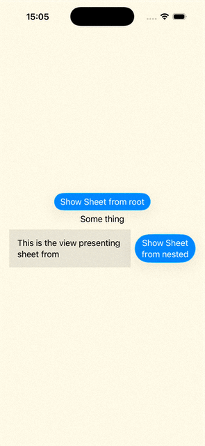

# SwiftUI_CustomBottomSheet

A custom bottom sheet that is presentable from any nested view without hard coding any screen size/safe area insets.

For more details, please refer to my blog [SwiftUI: Custom Bottom Sheet (Because System One Not Attached to Edges Anymore!)]()

Sample Usage:

```swift
struct CustomBottomSheetDemo: View {
    @State private var showSheet: Bool = false
    @State private var showSheetNested: Bool = false

    var body: some View {
        VStack {
            Button(
                action: {
                    showSheet = true
                },
                label: {
                    Text("Show Sheet from root")
                }
            )

            VStack {
                Text("Some thing")
                HStack {
                    Text("This is the view presenting sheet from")
                        .padding()
                        .background(Rectangle().fill(.gray.opacity(0.2)))
                        .bottomSheet(
                            isPresented: $showSheetNested,
                            detent: .medium,
                            cornerRadius: 38,
                            content: {
                                Text("Showing From nested")
                                    .frame(
                                        maxWidth: .infinity,
                                        maxHeight: .infinity
                                    )
                            }
                        )

                    Button(
                        action: {
                            showSheetNested = true
                        },
                        label: {
                            Text("Show Sheet from nested")
                        }
                    )
                }
            }
        }
        .padding()
        .buttonStyle(.glassProminent)
        .frame(maxWidth: .infinity, maxHeight: .infinity)
        .background(.yellow.opacity(0.1))
        .bottomSheet(
            isPresented: $showSheet,
            detent: .fraction(0.5),
            cornerRadius: 38,
            content: {
                Text("Showing From root")
                    .frame(maxWidth: .infinity, maxHeight: .infinity)
            }
        )
    }
}
```


